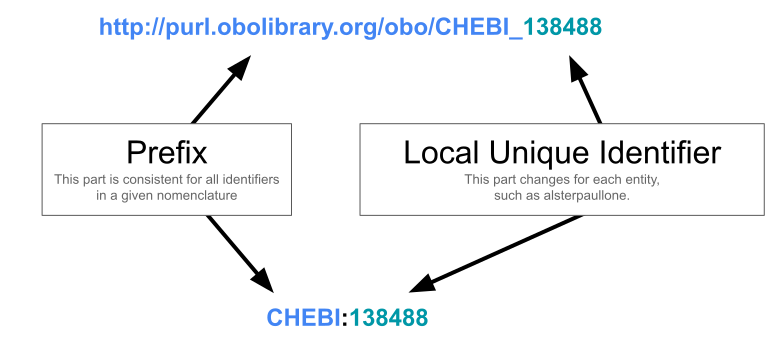

Data Structures
===============

A *semantic space* is a collections of identifiers for concepts. For example, the
Chemical Entities of Biomedical Interest (ChEBI) has a semantic space including
identifiers for chemicals. Within ChEBI's semantic space, `138488` corresponds to the
chemical `alsterpaullone <https://www.ebi.ac.uk/chebi/searchId.do?chebiId=138488>`_.

.. warning::

    `138488` is a *local unique identifier*. Other semantic spaces might use the same
    local unique identifier to refer to a different concept in their respective domain.

Therefore, local unique identifiers should be qualified with some additional information
saying what semantic space it comes from. The two common formalisms for doing this are
Uniform Resource Identifiers (URIs) and Compact URIs (CURIEs):

In many applications, it's important to be able to convert between CURIEs and URIs.
Therefore, we need a data structure that connects the CURIE prefixes like ``CHEBI`` to
the URI prefixes like ``http://purl.obolibrary.org/obo/CHEBI_``.

Prefix Maps
-----------

A prefix map is a dictionary data structure where keys represent CURIE prefixes and
their associated values represent URI prefixes. Ideally, these are constrained to be
bijective (i.e., no duplicate keys, no duplicate values), but this is not always done in
practice. Here's an example prefix map containing information about semantic spaces from
a small selection of OBO Foundry ontologies:

.. code-block:: json

    {
        "CHEBI": "http://purl.obolibrary.org/obo/CHEBI_",
        "MONDO": "http://purl.obolibrary.org/obo/MONDO_",
        "GO": "http://purl.obolibrary.org/obo/GO_"
    }

Prefix maps have the benefit of being simple and straightforward. They appear in many
linked data applications, including:

- the ``@prefix`` declarations at the top of Turtle (RDF) documents and SPARQL queries
- `JSON-LD <https://www.w3.org/TR/json-ld11/#prefix-definitions>`_
- XML documents
- OWL ontologies

.. note::

    Prefix maps can be loaded using :meth:`curies.Converter.from_prefix_map`.

*However*, prefix maps have the main limitation that they do not have first-class
support for synonyms of CURIE prefixes or URI prefixes. In practice, a variety of
synonyms are used for both. For example, the NCBI Taxonomy database appears with many
different CURIE prefixes:

============== ====================================
CURIE Prefix   Resource(s)
============== ====================================
``taxonomy``   Identifiers.org, Name-to-Thing
``taxon``      Gene Ontology Registry
``NCBITaxon``  OBO Foundry, Prefix Commons, OntoBee
``NCBITAXON``  BioPortal
``NCBI_TaxID`` Cellosaurus
``ncbitaxon``  OLS
``P685``       Wikidata
``fj07xj``     FAIRsharing
============== ====================================

Similarly, many different URIs can be constructed for the same ChEBI local unique
identifier. Using alsterpaullone as an example, this includes (many omitted):

==================================================== ===================
URI Prefix                                           Provider
==================================================== ===================
``https://www.ebi.ac.uk/chebi/searchId.do?chebiId=`` ChEBI (first-party)
``https://identifiers.org/CHEBI:``                   Identifiers.org
``https://identifiers.org/CHEBI/``                   Identifiers.org
``http://identifiers.org/CHEBI:``                    Identifiers.org
``http://identifiers.org/CHEBI/``                    Identifiers.org
``http://purl.obolibrary.org/obo/CHEBI_``            OBO Foundry
``https://n2t.net/chebi:``                           Name-to-thing
==================================================== ===================

In practice, we need to be able to support the fact that there are many CURIE prefixes
and URI prefixes for most semantic spaces as well as specify which CURIE prefix and URI
prefix is the "preferred" one in a given context. Prefix maps, unfortunately, have no
way to address this. Therefore, we're going to introduce a new data structure.

.. _epms:

Extended Prefix Maps
--------------------

Extended Prefix Maps (EPMs) address the issues with prefix maps by including explicit
fields for CURIE prefix synonyms and URI prefix synonyms while maintaining an explicit
field for the preferred CURIE prefix and URI prefix. An abbreviated example (just
containing an entry for ChEBI) looks like:

.. code-block:: json

    [
        {
            "prefix": "CHEBI",
            "uri_prefix": "http://purl.obolibrary.org/obo/CHEBI_",
            "prefix_synonyms": ["chebi"],
            "uri_prefix_synonyms": [
                "https://identifiers.org/chebi:"
            ]
        }
    ]

An EPM is simply a list of records (see :class:`curies.Record` and
:class:`curies.Records`). EPMs have the benefit that they are still encoded in JSON and
can easily be encoded in YAML, TOML, RDF, and other schemata. Further, prefix maps can
be automatically upgraded into EPMs (with some caveats) using
:func:`curies.upgrade_prefix_map`.

.. note::

    We are introducing this as a new standard in the :mod:`curies` package. They can be
    loaded using :meth:`curies.Converter.from_extended_prefix_map`. We provide a
    Pydantic model representing it. Later, we hope to have an external, stable
    definition of this data schema.

A JSON schema for EPMs is available at https://w3id.org/biopragmatics/schema/epm.json.
It can be updated at
https://github.com/biopragmatics/curies/tree/main/docs/make_schema.py.
