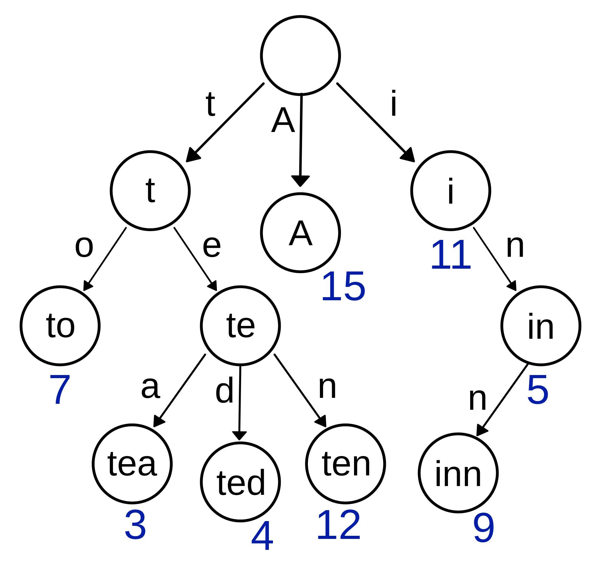

Getting Started
===============
Loading a Context
-----------------
There are several ways to load a context with this package, including:

1. pre-defined contexts
2. contexts encoded in the standard prefix map format
3. contexts encoded in the standard JSON-LD context format
4. contexts encoded in the extended prefix map format

Loading a pre-defined context
~~~~~~~~~~~~~~~~~~~~~~~~~~~~~
There exist many registries of semantic spaces that include CURIE
prefixes, URI prefixes, sometimes synonyms, and other associated
metadata. The Bioregistry provides a
`detailed overview <https://bioregistry.io/related>`_ of the registries available.
This package exposes a few high quality registries that are internally consistent
(i.e., are bijective).

==============  ==========================================
Name            Function
==============  ==========================================
Bioregistry     :func:`curies.get_bioregistry_converter`
OBO Foundry     :func:`curies.get_obo_converter`
Prefix Commons  :func:`curies.get_prefixcommons_converter`
Monarch         :func:`curies.get_monarch_converter`
Gene Ontology   :func:`curies.get_go_converter`
==============  ==========================================

These functions can be called directly to instantiate the :class:`curies.Converter`
class, which is used for compression, expansion, standardization, and other operations
below.

.. code-block:: python

    import curies

    # Uses the Bioregistry, an integrative, comprehensive registry
    bioregistry_converter = curies.get_bioregistry_converter()

    # Uses the OBO Foundry, a registry of ontologies
    obo_converter = curies.get_obo_converter()

    # Uses the Monarch Initiative project-specific context
    monarch_converter = curies.get_monarch_converter()

Loading Prefix Maps
~~~~~~~~~~~~~~~~~~~
A prefix map is a dictionary whose keys are CURIE prefixes and values are URI prefixes. An abridged example
using OBO Foundry preferred CURIE prefixes and URI prefixes is

.. code-block:: json

   {
       "CHEBI": "http://purl.obolibrary.org/obo/CHEBI_",
       "MONDO": "http://purl.obolibrary.org/obo/MONDO_",
       "GO": "http://purl.obolibrary.org/obo/GO_"
   }

Prefix maps can be loaded using the :func:`curies.load_prefix_map`. First,
a prefix map can be loaded directly from a Python data structure like in

.. code-block:: python

    import curies

    prefix_map = {
        "CHEBI": "http://purl.obolibrary.org/obo/CHEBI_"
    }
    converter = curies.load_prefix_map(data)

This function also accepts a string with a HTTP, HTTPS, or FTP path to a remote file as well as a local file path.

.. warning::

    Ideally, prefix maps are *bijective*, meaning that both the keys and values are unique.
    The Python dictionary data structure ensures that keys are unique, but sometimes values are repeated. For example,
    the CURIE prefixes ``DC`` and ``DCTERMS`` are often used interchangeably with the URI prefix for
    the `Dublin Core Metadata Initiative Terms <https://www.dublincore.org/specifications/dublin-core/dcmi-terms>`_.
    Therefore, many prefix maps are not bijective like

    .. code-block:: json

       {
           "DC": "http://purl.org/dc/terms/",
           "DCTERMS": "http://purl.org/dc/terms/"
       }

    If you load a prefix map that is not bijective, it can have unintended consequences. Therefore,
    an error is thrown. You can pass ``strict=False`` if you don't mind having unsafe data. A better data
    structure for situations when there can be CURIE synonyms or even URI prefix synonyms is
    the *extended prefix map* (see below).

    If you're not in a position where you can fix data issues upstream, you can try using the
    :func:`curies.upgrade_prefix_map` to extract a canonical extended prefix map from a non-bijective
    prefix map.

Loading Extended Prefix Maps
~~~~~~~~~~~~~~~~~~~~~~~~~~~~
Extended prefix maps (EPMs) address the issues with prefix maps by including explicit
fields for CURIE prefix synonyms and URI prefix synonyms while maintaining an explicit
field for the preferred CURIE prefix and URI prefix. An abbreviated example (just
containing an entry for ChEBI) looks like:

.. code-block:: json

   [
       {
           "prefix": "CHEBI",
           "uri_prefix": "http://purl.obolibrary.org/obo/CHEBI_",
           "prefix_synonyms": ["chebi"],
           "uri_prefix_synonyms": [
               "https://identifiers.org/chebi:"
           ]
       }
   ]

Extended prefix maps can be loaded with :func:`curies.load_extended_prefix_map`. First,
a prefix map can be loaded directly from a Python data structure like in

.. code-block:: python

    import curies

    epm = [
        {
            "prefix": "CHEBI",
            "uri_prefix": "http://purl.obolibrary.org/obo/CHEBI_",
            "prefix_synonyms": ["chebi"],
            "uri_prefix_synonyms": [
                "https://identifiers.org/chebi:"
            ]
        }
    ]
    converter = curies.load_extended_prefix_map(data)

An extended prefix map can be loaded from a remote file via HTTP, HTTPS, or FTP with

.. code-block:: python

    import curies

    url = "https://raw.githubusercontent.com/mapping-commons/sssom-py/master/src/sssom/obo.epm.json"
    converter = curies.load_extended_prefix_map(url)

Similarly, an extended prefix map stored in a local file can be loaded with the following.
This works with both :class:`pathlib.Path` and vanilla strings.

.. code-block:: python

    from pathlib import Path
    from urllib.request import urlretrieve

    import curies

    url = "https://raw.githubusercontent.com/mapping-commons/sssom-py/master/src/sssom/obo.epm.json"
    path = Path.home().joinpath("Downloads", "obo.epm.json")
    urlretrieve(url, path)
    converter = curies.load_extended_prefix_map(path)

Loading JSON-LD Contexts
~~~~~~~~~~~~~~~~~~~~~~~~
A `JSON-LD context <https://niem.github.io/json/reference/json-ld/context/>`_
allows for embedding of a simple prefix map within a linked data document.
They can be identified hiding in all sorts of JSON (or JSON-like) content
with the key ``@context``. JSON-LD contexts can be loaded using :meth:`curies.Converter.from_jsonld`.

First, a JSON-LD context can be loaded directly from a Python data structure like in

.. code-block:: python

    import curies

    data = {
        "@context": {
            "CHEBI": "http://purl.obolibrary.org/obo/CHEBI_"
        }
    }
    converter = curies.load_jsonld_context(data)

.. note::

    This correctly handles the more complex data structures including ``@prefix`` noted in
    `here <https://github.com/OBOFoundry/OBOFoundry.github.io/issues/2410>`_.

A JSON-LD context can be loaded from a remote file via HTTP, HTTPS, or FTP with

.. code-block:: python

    import curies

    url = "https://raw.githubusercontent.com/biopragmatics/bioregistry/main/exports/contexts/semweb.context.jsonld"
    converter = curies.load_jsonld_context(url)

A JSON-LD context stored in a local file can be loaded with the following.
This works with both :class:`pathlib.Path` and vanilla strings.

.. code-block:: python

    from pathlib import Path
    from urllib.request import urlretrieve

    import curies

    url = "https://raw.githubusercontent.com/biopragmatics/bioregistry/main/exports/contexts/semweb.context.jsonld"
    path = Path.home().joinpath("Downloads", "semweb.context.jsonld")
    urlretrieve(url, path)
    converter = curies.load_jsonld_context(path)

Loading SHACL
~~~~~~~~~~~~~
The `shapes constraint language (SHACL) <https://bioregistry.io/sh>`_ can be used to represent
prefix maps directly in RDF using the `sh:prefix` and `sh:namespace` predicates. Therefore, the
simple ChEBI example from before can be represented using

.. code-block:: turtle

    @prefix sh: <http://www.w3.org/ns/shacl#> .

    [
        sh:declare
        [
            sh:prefix "CHEBI" ;
            sh:namespace "http://purl.obolibrary.org/obo/CHEBI_" .
        ] .
    ]

A SHACL context can be loaded from a remote file via HTTP, HTTPS, or FTP with

.. code-block:: python

    import curies

    url = "https://raw.githubusercontent.com/biopragmatics/bioregistry/main/exports/contexts/semweb.context.ttl"
    converter = curies.load_shacl(url)


A SHACL context stored in a local file can be loaded with the following.
This works with both :class:`pathlib.Path` and vanilla strings.

.. code-block:: python

    from pathlib import Path
    from urllib.request import urlretrieve

    import curies

    url = "https://raw.githubusercontent.com/biopragmatics/bioregistry/main/exports/contexts/semweb.context.ttl"
    path = Path.home().joinpath("Downloads", "semweb.context.ttl")
    urlretrieve(url, path)
    converter = curies.load_shacl(path)

Introspecting on a Context
--------------------------
After loading a context, it's possible to get certain information out of the converter. For example, if you want to
get all of the CURIE prefixes from the converter, you can use :meth:`Converter.get_prefixes`:

.. code-block:: python

    import curies

    converter = curies.get_bioregistry_converter()
    prefixes = converter.get_prefixes()
    assert 'chebi' in prefixes
    assert 'CHEBIID' not in prefixes, "No synonyms are included by default"

    prefixes = converter.get_prefixes(include_synonyms=True)
    assert 'chebi' in prefixes
    assert 'CHEBIID' in prefixes

Similarly, the URI prefixes can be extracted with :meth:`Converter.get_uri_prefixes` like in:

.. code-block:: python

    import curies

    converter = curies.get_bioregistry_converter()
    uri_prefixes = converter.get_uri_prefixes()
    assert 'http://purl.obolibrary.org/obo/CHEBI_' in prefixes
    assert 'https://bioregistry.io/chebi:' not in prefixes, "No synonyms are included by default"

    uri_prefixes = converter.get_uri_prefixes(include_synonyms=True)
    assert 'http://purl.obolibrary.org/obo/CHEBI_' in prefixes
    assert 'https://bioregistry.io/chebi:' in prefixes

It's also possible to get a bijective prefix map, i.e., a dictionary from primary CURIE prefixes
to primary URI prefixes. This is useful for compatibility with legacy systems which assume simple prefix maps.
This can be done with the ``bimap`` property like in the following:

.. code-block:: python

    import curies

    converter = curies.get_bioregistry_converter()
    prefix_map = converter.bimap

    assert prefix_map['chebi'] == 'http://purl.obolibrary.org/obo/CHEBI_'

Modifying a Context
-------------------
Incremental Converters
~~~~~~~~~~~~~~~~~~~~~~
As suggested in `#13 <https://github.com/cthoyt/curies/issues/33>`_, new data
can be added to an existing converter with either
:meth:`curies.Converter.add_prefix` or :meth:`curies.Converter.add_record`.
For example, a CURIE and URI prefix for HGNC can be added to the OBO Foundry
converter with the following:

.. code-block::

    import curies

    converter = curies.get_obo_converter()
    converter.add_prefix("hgnc", "https://bioregistry.io/hgnc:")

Similarly, an empty converter can be instantiated using an empty list
for the `records` argument and prefixes can be added one at a time
(note this currently does not allow for adding synonyms separately):

.. code-block::

    import curies

    converter = curies.Converter(records=[])
    converter.add_prefix("hgnc", "https://bioregistry.io/hgnc:")

A more flexible version of this operation first involves constructing
a :class:`curies.Record` object:

.. code-block::

    import curies

    converter = curies.get_obo_converter()
    record = curies.Record(prefix="hgnc", uri_prefix="https://bioregistry.io/hgnc:")
    converter.add_record(record)

By default, both of these operations will fail if the new content conflicts with existing content.
If desired, the ``merge`` argument can be set to true to enable merging. Further, checking
for conflicts and merging can be made to be case insensitive by setting ``case_sensitive`` to false.

Such a merging strategy is the basis for wholesale merging of converters, described below.

Chaining and Merging
~~~~~~~~~~~~~~~~~~~~
This package implements a faultless chain operation :func:`curies.chain` that is configurable for case
sensitivity and fully considers all synonyms.

:func:`curies.chain` prioritizes based on the order given. Therefore, if two prefix maps
having the same prefix but different URI prefixes are given, the first is retained. The second
is retained as a synonym

>>> import curies
>>> c1 = curies.load_prefix_map({"GO": "http://purl.obolibrary.org/obo/GO_"})
>>> c2 = curies.load_prefix_map({"GO": "https://identifiers.org/go:"})
>>> converter = curies.chain([c1, c2])
>>> converter.expand("GO:1234567")
'http://purl.obolibrary.org/obo/GO_1234567'
>>> converter.compress("http://purl.obolibrary.org/obo/GO_1234567")
'GO:1234567'
>>> converter.compress("https://identifiers.org/go:1234567")
'GO:1234567'

Chain is the perfect tool if you want to override parts of an existing extended
prefix map. For example, if you want to use most of the Bioregistry, but you
would like to specify a custom URI prefix (e.g., using Identifiers.org), you
can do the following

.. code-block:: python

    import curies

    overrides = curies.load_prefix_map({"pubmed": "https://identifiers.org/pubmed:"})
    bioregistry_converter = curies.get_bioregistry_converter()
    converter = curies.chain([overrides, bioregistry_converter])

    assert converter.expand("pubmed:1234") == 'https://identifiers.org/pubmed:1234'

Subsetting
~~~~~~~~~~
A subset of a converter can be extracted using :meth:`curies.Converter.get_subconverter`.
This functionality is useful for downstream applications like the following:

1. You load a comprehensive extended prefix map, e.g., from the Bioregistry using
   :func:`curies.get_bioregistry_converter()`.
2. You load some data that conforms to this prefix map by convention. This
   is often the case for semantic mappings stored in the
   `SSSOM format <https://github.com/mapping-commons/sssom>`_.
3. You extract the list of prefixes *actually* used within your data
4. You subset the detailed extended prefix map to only include prefixes
   relevant for your data
5. You make some kind of output of the subsetted extended prefix map to
   go with your data. Effectively, this is a way of reconciling data. This
   is especially effective when using the Bioregistry or other comprehensive
   extended prefix maps.

Here's a concrete example of doing this (which also includes a bit of data science)
to do this on the SSSOM mappings from the `Disease Ontology <https://disease-ontology.org/>`_
project.

>>> import curies
>>> import pandas as pd
>>> import itertools as itt
>>> commit = "faca4fc335f9a61902b9c47a1facd52a0d3d2f8b"
>>> url = f"https://raw.githubusercontent.com/mapping-commons/disease-mappings/{commit}/mappings/doid.sssom.tsv"
>>> df = pd.read_csv(url, sep="\t", comment='#')
>>> prefixes = {
...     curies.Reference.from_curie(curie).prefix
...     for column in ["subject_id", "predicate_id", "object_id"]
...     for curie in df[column]
... }
>>> converter = curies.get_bioregistry_converter()
>>> slim_converter = converter.get_subconverter(prefixes)

Writing a Context
-----------------
After loading and modifying a context, there are several functions for writing
a context to a file:

- :func:`curies.write_extended_prefix_map`
- :func:`curies.write_jsonld_context`
- :func:`curies.write_shacl`
- :func:`curies.write_tsv`

Here's a self-contained example on how this works:

.. code-block:: python

        import curies
        converter = curies.load_prefix_map({
            "CHEBI": "http://purl.obolibrary.org/obo/CHEBI_",
        })
        curies.write_shacl(converter, "example_shacl.ttl")

which outputs the following file:

.. code-block::

    @prefix sh: <http://www.w3.org/ns/shacl#> .
    @prefix xsd: <http://www.w3.org/2001/XMLSchema#> .

    [
      sh:declare
        [ sh:prefix "CHEBI" ; sh:namespace "http://purl.obolibrary.org/obo/CHEBI_"^^xsd:anyURI  ]
    ] .

Faultless handling of overlapping URI prefixes
----------------------------------------------
Most implementations of URI parsing iterate through the CURIE prefix/URI prefix pairs
in a prefix map, check if the given URI starts with the URI prefix, then returns the
CURIE prefix if does. This becomes an issue when a given URI can match multiple
overlapping URI prefixes in the prefix map. For example, the ChEBI URI prefix is
``http://purl.obolibrary.org/obo/CHEBI_`` and the more generic OBO URI prefix
is ``http://purl.obolibrary.org/obo/``. Therefore, it is possible that a URI could be
compressed two different ways, depending on the order of iteration.

:mod:`curies` addresses this by using the `trie <https://en.wikipedia.org/wiki/Trie>`_
data structure, which indexes potentially overlapping strings and allows for efficient
lookup of the longest matching string (e.g., the URI prefix) in the tree to a given target string
(e.g., the URI).



This has two benefits. First, it is correct. Second, searching the trie data structure can be done
in sublinear time while iterating over a prefix map can only be done in linear time. When processing
a lot of data, this makes a meaningful difference!

The following code demonstrates that the scenario above. It will always return the correct
CURIE ``CHEBI:1`` instead of the incorrect CURIE ``OBO:CHEBI_1``, regardless of the order of
the dictionary, iteration, or any other factors.

.. code-block::

    import curies

    converter = curies.load_prefix_map({
        "CHEBI": "http://purl.obolibrary.org/obo/CHEBI_",
        "OBO": "http://purl.obolibrary.org/obo/
    })

    >>> converter.compress("http://purl.obolibrary.org/obo/CHEBI_1")
    'CHEBI:1'

Standardization
---------------
The :class:`curies.Converter` data structure supports prefix and URI prefix synonyms.
The following example demonstrates
using these synonyms to support standardizing prefixes, CURIEs, and URIs. Note below,
the colloquial prefix `gomf`, sometimes used to represent the subspace in the
`Gene Ontology (GO) <https://obofoundry.org/ontology/go>`_ corresponding to molecular
functions, is upgraded to the preferred prefix, ``GO``.

.. code-block::

    from curies import Converter, Record

    converter = Converter([
        Record(
            prefix="GO",
            prefix_synonyms=["gomf", "gocc", "gobp", "go", ...],
            uri_prefix="http://purl.obolibrary.org/obo/GO_",
            uri_prefix_synonyms=[
                "http://amigo.geneontology.org/amigo/term/GO:",
                "https://identifiers.org/GO:",
                ...
            ],
        ),
        # And so on
        ...
    ])

    >>> converter.standardize_prefix("gomf")
    'GO'
    >>> converter.standardize_curie('gomf:0032571')
    'GO:0032571'
    >>> converter.standardize_uri('http://amigo.geneontology.org/amigo/term/GO:0032571')
    'http://purl.obolibrary.org/obo/GO_0032571'

Note: non-standard URIs (i.e., ones based on URI prefix synonyms) can still be parsed with
:meth:`curies.Converter.parse_uri` and compressed
into CURIEs with :meth:`curies.Converter.compress`.

Bulk Operations
---------------
Expansion, compression, and standardization operations can be done in bulk to all rows
in a :class:`pandas.DataFrame` using the following examples.

Bulk Compress URIs
~~~~~~~~~~~~~~~~~~
In order to demonstrate bulk operations using :meth:`curies.Converter.pd_compress`,
we construct a small dataframe:

.. code-block:: python

    import curies
    import pandas as pd

    df = pd.DataFrame({"uri": [
        "http://purl.obolibrary.org/obo/GO_0000010",
        "http://purl.obolibrary.org/obo/GO_0000011",
        "http://gudt.org/schema/gudt/baseCGSUnitDimensions",
        "http://qudt.org/schema/qudt/conversionMultiplier",
    ]})

    converter = curies.get_obo_converter()
    converter.pd_compress(df, column="uri", target_column="curie")

Results will look like:

=================================================  ==========
uri                                                curie
=================================================  ==========
http://purl.obolibrary.org/obo/GO_0000010          GO:0000010
http://purl.obolibrary.org/obo/GO_0000011          GO:0000011
http://gudt.org/schema/gudt/baseCGSUnitDimensions
http://qudt.org/schema/qudt/conversionMultiplier
=================================================  ==========

Note that some URIs are not handled by the extended prefix map inside the converter, so if you want
to pass those through, use ``passthrough=True`` like in

.. code-block:: python

    converter.pd_compress(df, column="uri", target_column="curie", passthrough=True)

=================================================  =================================================
uri                                                curie
=================================================  =================================================
http://purl.obolibrary.org/obo/GO_0000010          GO:0000010
http://purl.obolibrary.org/obo/GO_0000011          GO:0000011
http://gudt.org/schema/gudt/baseCGSUnitDimensions  http://gudt.org/schema/gudt/baseCGSUnitDimensions
http://qudt.org/schema/qudt/conversionMultiplier   http://qudt.org/schema/qudt/conversionMultiplier
=================================================  =================================================

The keyword ``ambiguous=True`` can be passed if the source column can either be a CURIE
or URI. Then, the semantics of compression are used from :meth:`curies.Converter.compress_or_standardize`.

Bulk Expand CURIEs
~~~~~~~~~~~~~~~~~~
In order to demonstrate bulk operations using :meth:`curies.Converter.pd_expand`,
we construct a small dataframe used in conjunction with the OBO converter (which
only includes OBO Foundry ontology URI prefix expansions):

.. code-block:: python

    import curies
    import pandas as pd

    df = pd.DataFrame({"curie": [
        "GO:0000001",
        "skos:exactMatch",
    ]})

    converter = curies.get_obo_converter()
    converter.pd_expand(df, column="curie", target_column="uri")

===============  =========================================
curie            uri
===============  =========================================
GO:0000001       http://purl.obolibrary.org/obo/GO_0000001
skos:exactMatch
===============  =========================================

Note that since ``skos`` is not in the OBO Foundry extended prefix map, no results are placed in
the ``uri`` column. If you wan to pass through elements that can't be expanded, you can use
``passthrough=True`` like in:

.. code-block:: python

    converter.pd_expand(df, column="curie", target_column="uri", passthrough=True)

===============  =========================================
curie            uri
===============  =========================================
GO:0000001       http://purl.obolibrary.org/obo/GO_0000001
skos:exactMatch  skos:exactMatch
===============  =========================================

Alternatively, chaining together multiple converters (such as the Bioregistry) will yield better results

.. code-block:: python

    import curies
    import pandas as pd

    df = pd.DataFrame({"curie":  [
        "GO:0000001",
        "skos:exactMatch",
    ]})

    converter = curies.chain([
        curies.get_obo_converter(),
        curies.get_bioregistry_converter(),
    ])
    converter.pd_expand(df, column="curie", target_column="uri")

===============  ==============================================
curie            uri
===============  ==============================================
GO:0000001       http://purl.obolibrary.org/obo/GO_0000001
skos:exactMatch  http://www.w3.org/2004/02/skos/core#exactMatch
===============  ==============================================

The keyword ``ambiguous=True`` can be passed if the source column can either be a CURIE
or URI. Then, the semantics of compression are used from :meth:`curies.Converter.compress_or_standardize`.

Bulk Standardizing Prefixes
~~~~~~~~~~~~~~~~~~~~~~~~~~~
The `Gene Ontology (GO) Annotations Database <https://geneontology.org/docs/go-annotations/>`_
distributes its file where references to proteins from the `Universal Protein Resource (UniProt)
<https://www.uniprot.org/>`_ use the prefix ``UniProtKB``. When using the Bioregistry's extended prefix map,
these prefixes should be standardized to ``uniprot`` with :meth:`curies.Converter.pd_standardize_prefix`.
This can be done in-place with the following:

.. code-block:: python

    import pandas
    import curies

    # the first column represents the prefix for the protein,
    # called "DB" in the schema. This is where we want to upgrade
    # `UniProtKB` to `uniprot`
    df = pd.read_csv(
        "http://geneontology.org/gene-associations/goa_human.gaf.gz",
        sep="\t",
        comment="!",
        header=None,
    )

    converter = curies.get_bioregistry_converter()
    converter.pd_standardize_prefix(df, column=0)

The ``target_column`` keyword can be given if you don't want to overwrite the original.

Bulk Standardizing CURIEs
~~~~~~~~~~~~~~~~~~~~~~~~~
Using the same example data from GO, the sixth column contains CURIE for references such as
`GO_REF:0000043 <https://bioregistry.io/go.ref:0000043>`_. When using the Bioregistry's extended prefix map,
these CURIEs' prefixes should be standardized to ``go.ref`` with :meth:`curies.Converter.pd_standardize_curie`.
This can be done in-place with the following:

.. code-block:: python

    import pandas
    import curies

    df = pd.read_csv(
        "http://geneontology.org/gene-associations/goa_human.gaf.gz",
        sep="\t",
        comment="!",
        header=None,
    )

    converter = curies.get_bioregistry_converter()
    converter.pd_standardize_curie(df, column=5)

The ``target_column`` keyword can be given if you don't want to overwrite the original.

File Operations
~~~~~~~~~~~~~~~
Apply in bulk to a CSV file with :meth:`curies.Converter.file_expand` and
:meth:`curies.Converter.file_compress` (defaults to using tab separator):

.. code-block:: python

    import curies

    path = ...
    converter = curies.get_obo_converter()
    # modifies file in place
    converter.file_compress(path, column=0)
    # modifies file in place
    converter.file_expand(path, column=0)

Like with the Pandas operations, the keyword ``ambiguous=True``` can be set
when entries can either be CURIEs or URIs.

Tools for Developers and Semantic Engineers
-------------------------------------------

Working with strings that might be a URI or a CURIE
~~~~~~~~~~~~~~~~~~~~~~~~~~~~~~~~~~~~~~~~~~~~~~~~~~~
Sometimes, it's not clear if a string is a CURIE or a URI. While
the `SafeCURIE syntax <https://www.w3.org/TR/2010/NOTE-curie-20101216/#P_safe_curie>`_
is intended to address this, it's often overlooked.

CURIE and URI Checks
********************
The first way to handle this ambiguity is to be able to check if the string is a CURIE
or a URI. Therefore, each :class:`curies.Converter`
comes with functions for checking if a string is a CURIE (:meth:`curies.Converter.is_curie`)
or a URI (:meth:`curies.Converter.is_uri`) under its definition.

.. code-block:: python

    import curies

    converter = curies.get_obo_converter()

    >>> converter.is_curie("GO:1234567")
    True
    >>> converter.is_curie("http://purl.obolibrary.org/obo/GO_1234567")
    False
    # This is a valid CURIE, but not under this converter's definition
    >>> converter.is_curie("pdb:2gc4")
    False

    >>> converter.is_uri("http://purl.obolibrary.org/obo/GO_1234567")
    True
    >>> converter.is_uri("GO:1234567")
    False
    # This is a valid URI, but not under this converter's definition
    >>> converter.is_uri("http://proteopedia.org/wiki/index.php/2gc4")
    False

Extended Expansion and Compression
**********************************
The :meth:`curies.Converter.expand_or_standardize` extends the CURIE expansion function to handle the situation where
you might get passed a CURIE or a URI. If it's a CURIE, expansions happen with the normal
rules. If it's a URI, it tries to standardize it.

.. code-block:: python

    from curies import Converter, Record
    converter = Converter.from_extended_prefix_map([
        Record(
            prefix="CHEBI",
            prefix_synonyms=["chebi"],
            uri_prefix="http://purl.obolibrary.org/obo/CHEBI_",
            uri_prefix_synonyms=["https://identifiers.org/chebi:"],
        ),
    ])

    # Expand CURIEs
    >>> converter.expand_or_standardize("CHEBI:138488")
    'http://purl.obolibrary.org/obo/CHEBI_138488'
    >>> converter.expand_or_standardize("chebi:138488")
    'http://purl.obolibrary.org/obo/CHEBI_138488'

    # standardize URIs
    >>> converter.expand_or_standardize("http://purl.obolibrary.org/obo/CHEBI_138488")
    'http://purl.obolibrary.org/obo/CHEBI_138488'
    >>> converter.expand_or_standardize("https://identifiers.org/chebi:138488")
    'http://purl.obolibrary.org/obo/CHEBI_138488'

    # Handle cases that aren't valid w.r.t. the converter
    >>> converter.expand_or_standardize("missing:0000000")
    >>> converter.expand_or_standardize("https://example.com/missing:0000000")

A similar workflow is implemented in :meth:`curies.Converter.compress_or_standardize` for compressing URIs
where a CURIE might get passed.

.. code-block:: python

    from curies import Converter, Record
    converter = Converter.from_extended_prefix_map([
        Record(
            prefix="CHEBI",
            prefix_synonyms=["chebi"],
            uri_prefix="http://purl.obolibrary.org/obo/CHEBI_",
            uri_prefix_synonyms=["https://identifiers.org/chebi:"],
        ),
    ])

    # Compress URIs
    >>> converter.compress_or_standardize("http://purl.obolibrary.org/obo/CHEBI_138488")
    'CHEBI:138488'
    >>> converter.compress_or_standardize("https://identifiers.org/chebi:138488")
    'CHEBI:138488'

    # standardize CURIEs
    >>> converter.compress_or_standardize("CHEBI:138488")
    'CHEBI:138488'
    >>> converter.compress_or_standardize("chebi:138488")
    'CHEBI:138488'

    # Handle cases that aren't valid w.r.t. the converter
    >>> converter.compress_or_standardize("missing:0000000")
    >>> converter.compress_or_standardize("https://example.com/missing:0000000")

Reusable data structures for references
~~~~~~~~~~~~~~~~~~~~~~~~~~~~~~~~~~~~~~~
While URIs and CURIEs are often represented as strings, for many programmatic applications,
it is preferable to pre-parse them into a pair of prefix corresponding to a semantic space
and local unique identifier from that semantic space. ``curies`` provides two complementary
data structures for representing these pairs:

1. :mod:`curies.ReferenceTuple` - a native Python :class:`typing.NamedTuple` that is
   storage efficient, can be hashed, can be accessed by slicing, unpacking, or via attributes.
2. :mod:`curies.Reference` - a :class:`pydantic.BaseModel` that can be used directly
   with other Pydantic models, FastAPI, SQLModel, and other JSON-schemata

Internally, :mod:`curies.ReferenceTuple` is used, but there is a big benefit to standardizing
this data type and providing utilities to flip-flop back and forth to :mod:`curies.Reference`,
which is preferable in data validation (such as when parsing OBO ontologies)

Integrating with :mod:`rdflib`
~~~~~~~~~~~~~~~~~~~~~~~~~~~~~~
RDFlib is a pure Python package for manipulating RDF data. The following example shows how to bind the
extended prefix map from a :class:`curies.Converter` to a graph (:class:`rdflib.Graph`).

.. code-block::

    import curies, rdflib, rdflib.namespace

    converter = curies.get_obo_converter()
    graph = rdflib.Graph()

    for prefix, uri_prefix in converter.bimap.items():
        graph.bind(prefix, rdflib.Namespace(uri_prefix))

A more flexible approach is to instantiate a namespace manager (:class:`rdflib.namespace.NamespaceManager`)
and bind directly to that.

.. code-block::

    import curies, rdflib

    converter = curies.get_obo_converter()
    namespace_manager = rdflib.namespace.NamespaceManager(rdflib.Graph())

    for prefix, uri_prefix in converter.bimap.items():
        namespace_manager.bind(prefix, rdflib.Namespace(uri_prefix))

URI references for use in RDFLib's graph class can be constructed from
CURIEs using a combination of :meth:`curies.Converter.expand` and :class:`rdflib.URIRef`.

.. code-block::

    import curies, rdflib

    converter = curies.get_obo_converter()

    uri_ref = rdflib.URIRef(converter.expand("CHEBI:138488", strict=True))
